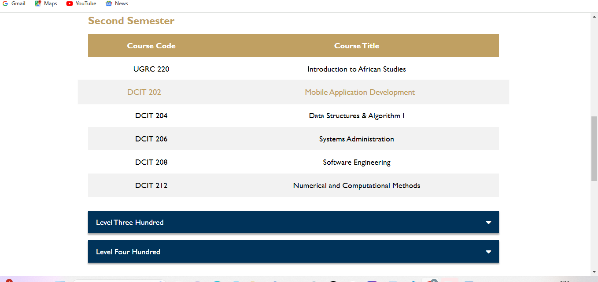
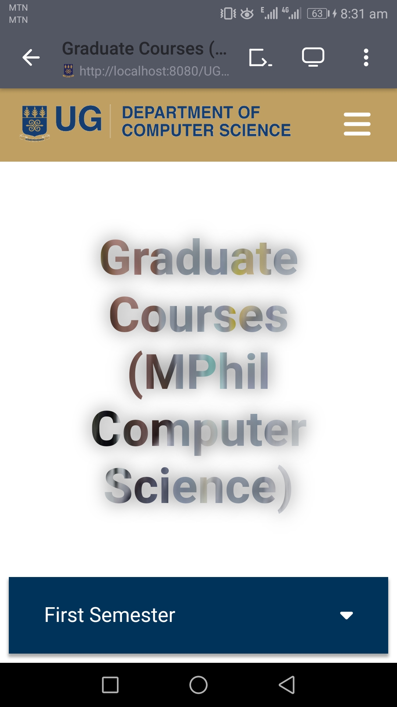
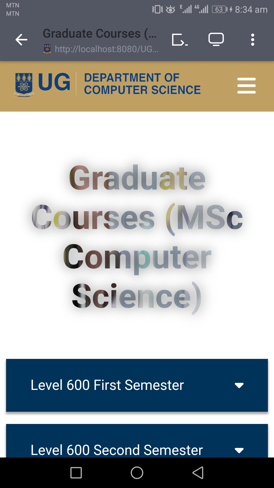
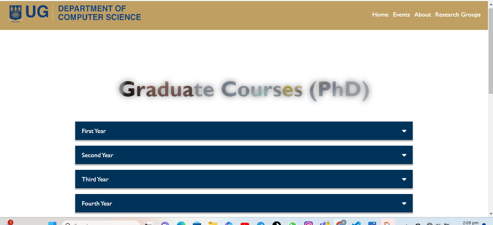
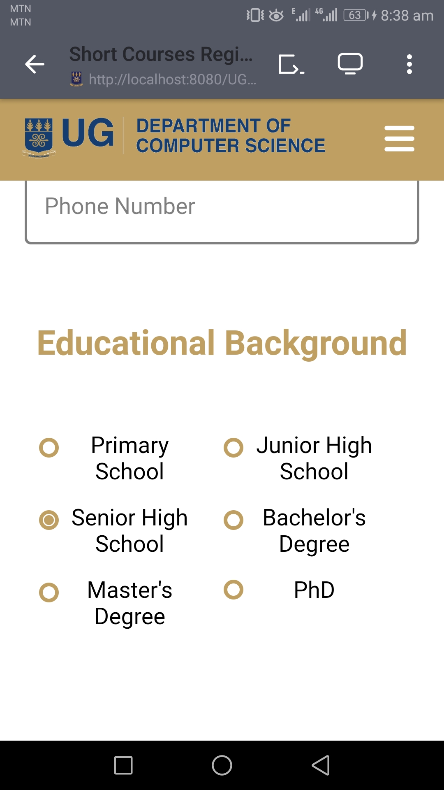
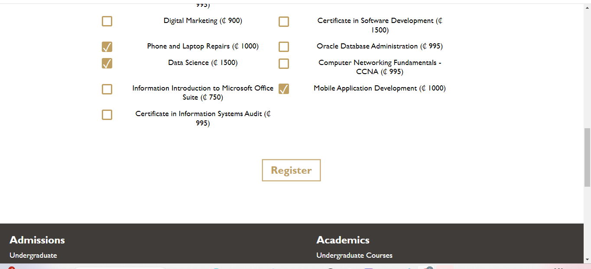
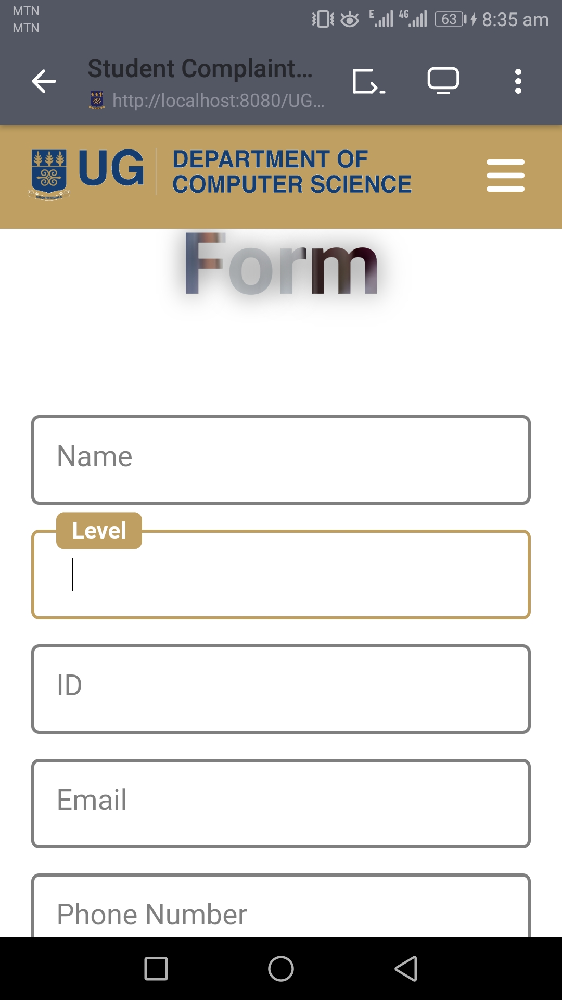
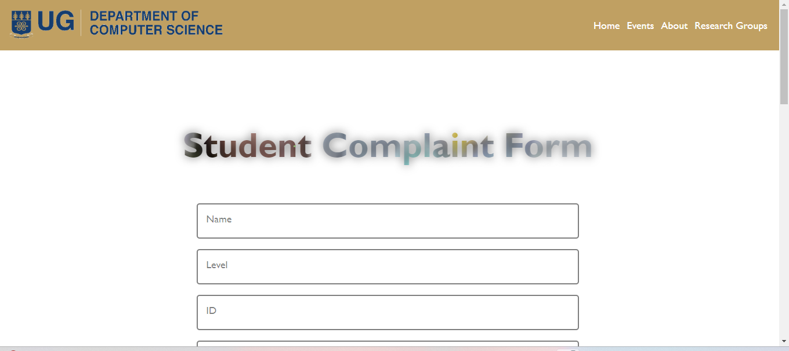
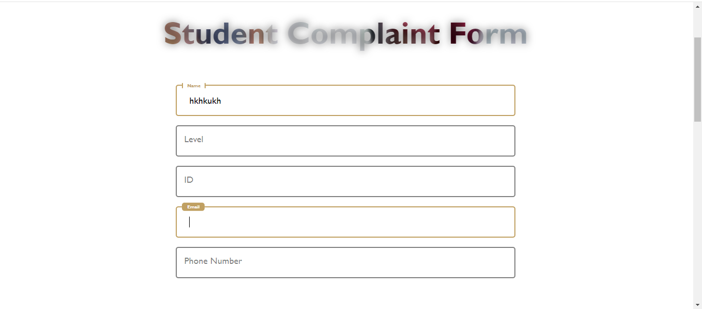
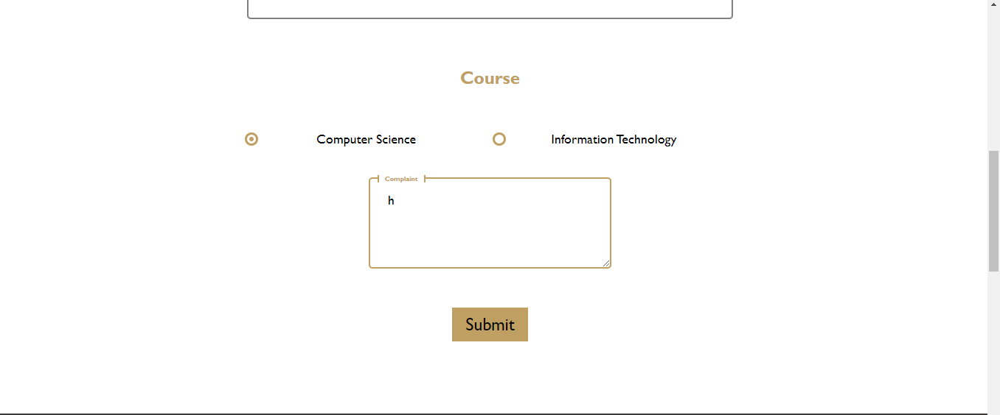

# University of Ghana - Department of Computer Science Website (Revamped)

This [project](https://programming-sai.github.io/UG-CS-Department-Revamp/index) is a revamped version of the [official website](https://dcs.ug.edu.gh/) for the University of Ghana's Department of Computer Science. The aim is to provide a modern, user-friendly interface while retaining all the necessary information ands functionalities.

## Table of Contents

- [Overview](#overview)
- [Features](#features)
- [Technologies Used](#technologies-used)
- [Setup Instructions](#setup-instructions)
- [Screenshots](#screenshots)

## Overview

The revamped website includes sections for admissions, academics, department information, research, and contact details. It is designed to provide easy access to information for students, faculty, and visitors.

## Features

- **Responsive Design**: Adapts to various screen sizes for optimal viewing on all devices.
- **Navigation Menu**: Easy-to-use navigation for quick access to different sections.

## Technologies Used

- **HTML5**: Structure of the website.
- **CSS3**: Styling of the website, including external stylesheets for general styles, home styles, and FontAwesome for icons.
- **JavaScript**: For interactivity, including opening and closing the navigation menu.

## Setup Instructions

1. **Clone the Repository**:
   ```sh
   git clone https://github.com/Programming-Sai/SolarSystem.git
   ```

2. **Navigate to the Project Directory**:
   ```sh
   cd SolarSystem
   ```

3. **Open the HTML File**:
   Open `index.html` in your preferred web browser to view the website.


## Screenshots

### Home Page

#### Mobile


 with 


#### Laptop/Desktop


### About Page

#### Mobile


#### Laptop/Desktop 


### Event Page

#### Mobile


#### Laptop/Desktop 


### Research Groups Page

#### Mobile


#### Laptop/Desktop 


### Undergraduate Courses Page

#### Mobile


#### Laptop/Desktop 





### Graduate Courses Page (MPhil)

#### Mobile




#### Laptop/Desktop 


### Graduate Courses Page (MSc)

#### Mobile





#### Laptop/Desktop 


### Graduate Courses Page (PhD)

#### Mobile


#### Laptop/Desktop 





### Short Courses Registration Form Page

#### Mobile





#### Laptop/Desktop 





### Students Complaint Form Page

#### Mobile





#### Laptop/Desktop 






## Project Insights

Throughout this project, I gained a better understanding in the usage of:
- **Web Development:** Utilizing HTML, CSS, and JavaScript for a responsive and visually appealing interface.
- **Version Control:** Effectively using Git for collaborative development and version management.
- **Documentation:** Writing clear and concise documentation for the project.

### 
