# University Of Ghana Computer Science Department Website

## Introduction

This is the repository for the University Computer Science Department website. This project aims to provide a redesigned web site for the department.

## Purpose

The website serves the following purposes:
- **Short Courses:** Provides short courses on various subjects.
- **Complaint Form:** Provides a form with which students can use to raise and submit general complaints.
- **General Courses:** Provides all courses for various subjects from the undergraduate stage up to the PhD stage.
- **Event Announcements:** Stay updated on upcoming events, seminars, and workshops.

amongst others.

## Setup Instructions

### Clone the Repository

```bash
git clone https://github.com/Programming-Sai/DCIT_205_IA.git
```

### Inspection 

1. Navigate to the project directory.
2. Open "UG-CS-Home.html"  and run with Live Server, to view the redesigned page 
3. To view the other pages, use the varios links provided on each page to navigate.

## Author

- **Mensah Lartey Isaiah Nii-larte**
- **Student ID: 11222100**

## Screenshots

### Home Page

#### Mobile


 with 


#### Laptop/Desktop


### About Page

#### Mobile


#### Laptop/Desktop 


### Event Page

#### Mobile


#### Laptop/Desktop 


### Research Groups Page

#### Mobile


#### Laptop/Desktop 


### Undergraduate Courses Page

#### Mobile

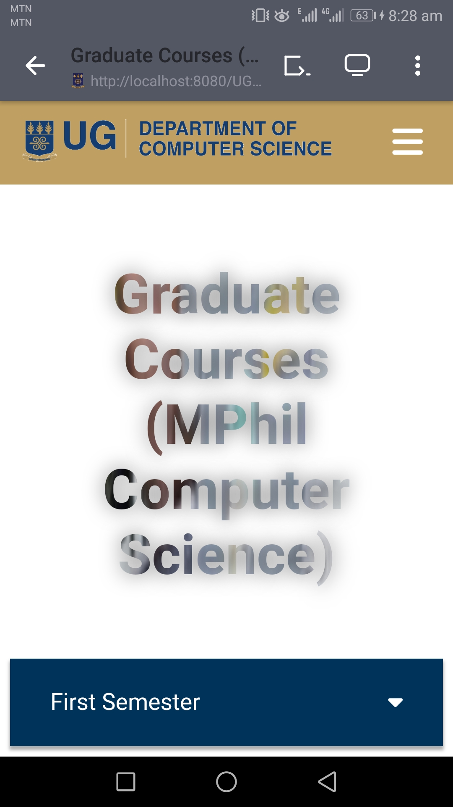

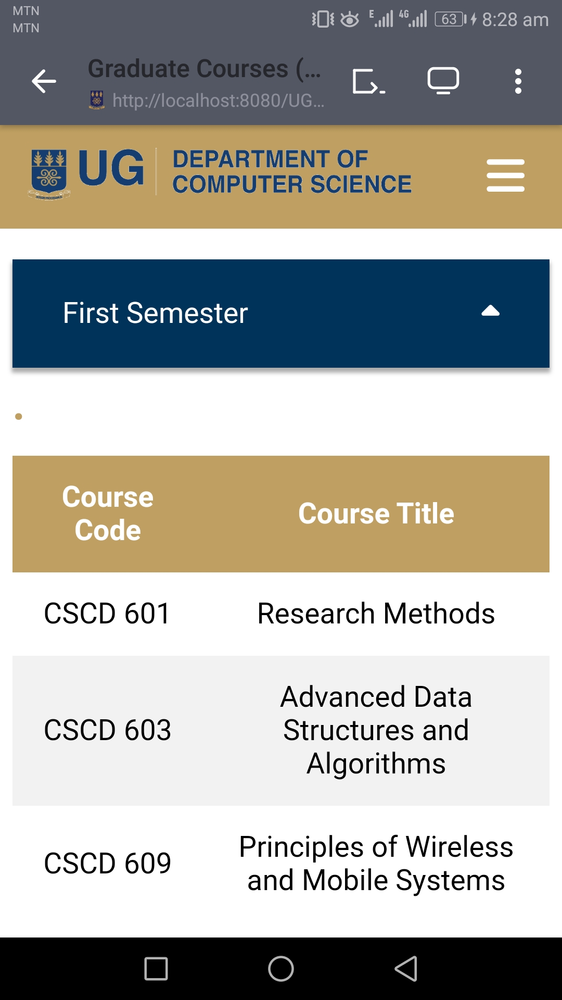
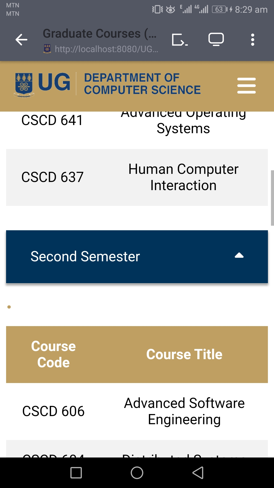
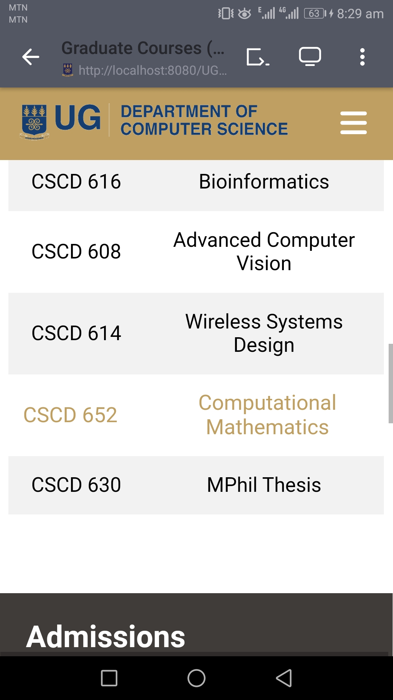

#### Laptop/Desktop 

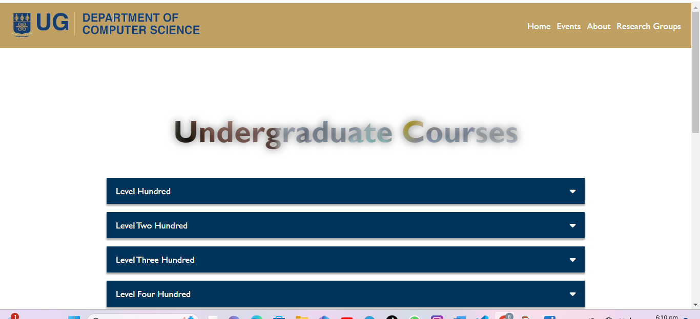
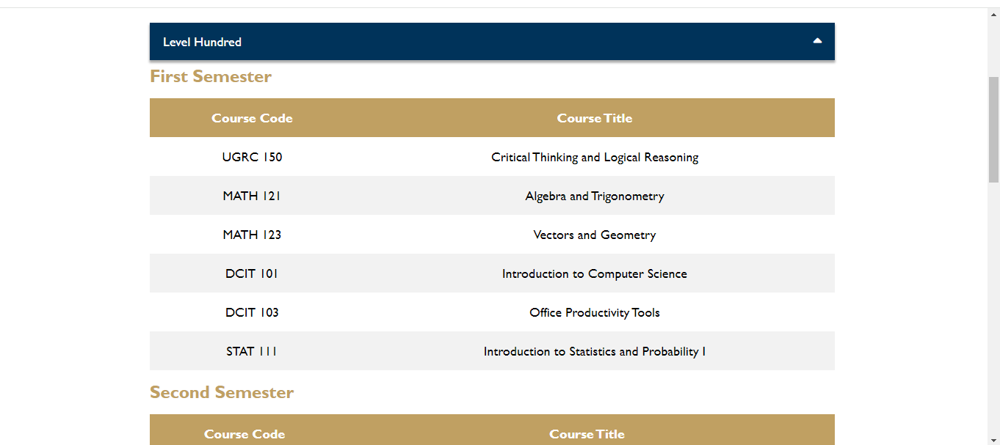


### Graduate Courses Page (MPhil)

#### Mobile


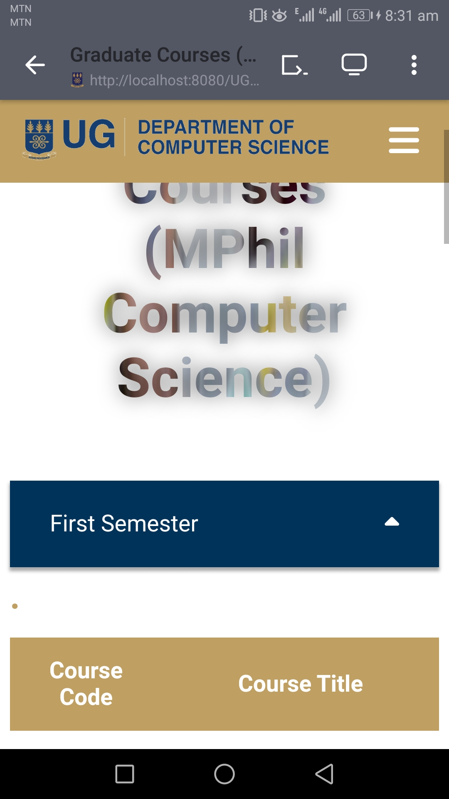

#### Laptop/Desktop 


### Graduate Courses Page (MSc)

#### Mobile


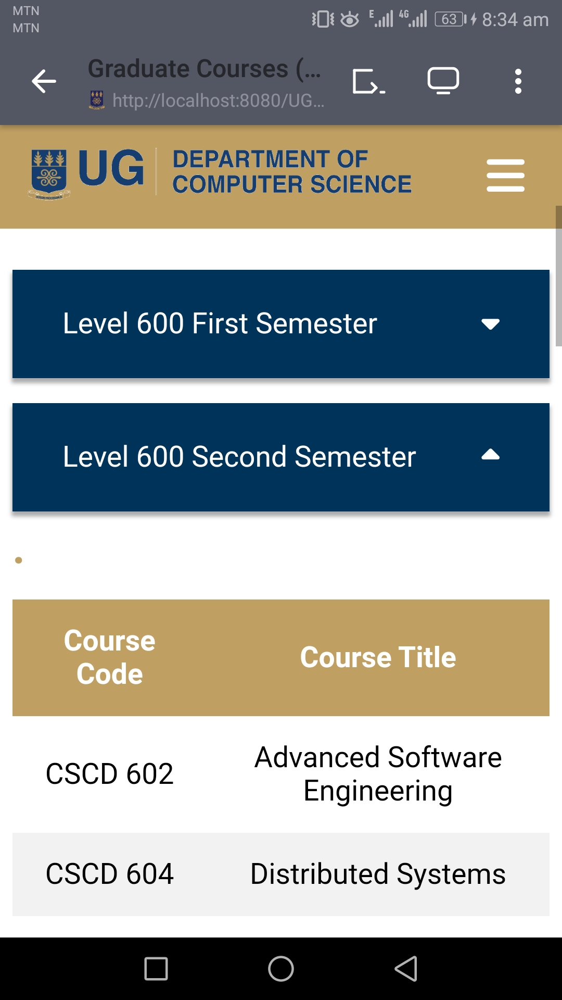

#### Laptop/Desktop 


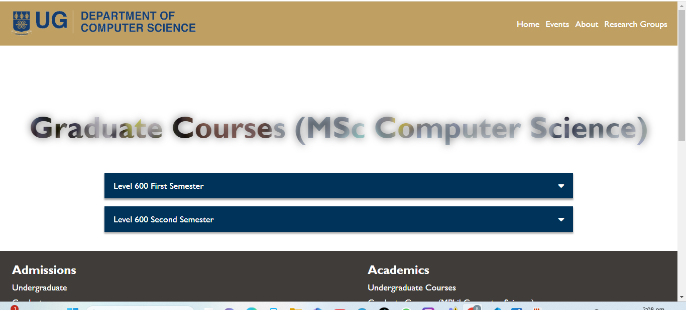

### Graduate Courses Page (PhD)

#### Mobile


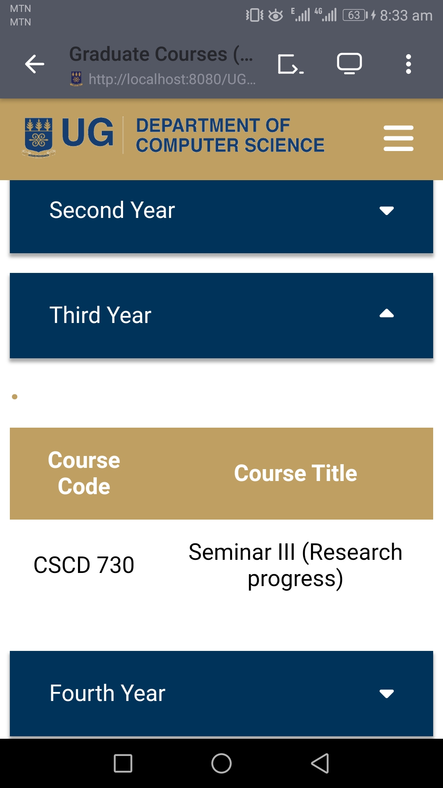

#### Laptop/Desktop 


### Short Courses Registration Form Page

#### Mobile

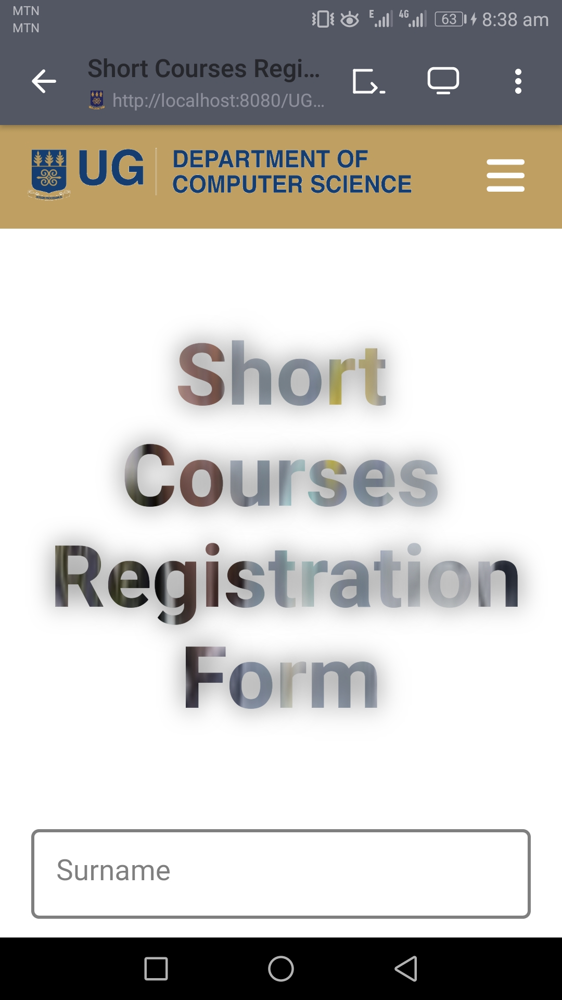


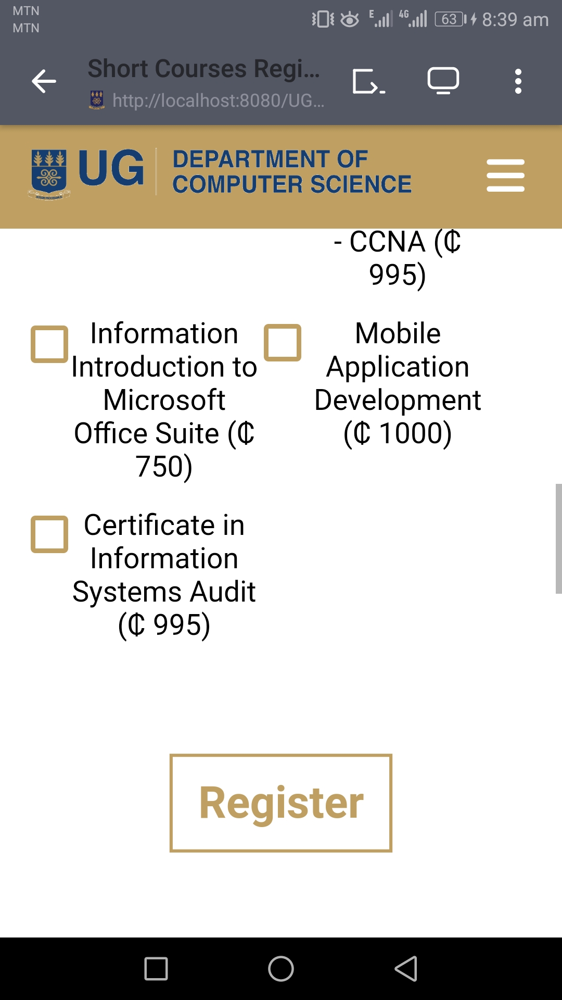

#### Laptop/Desktop 

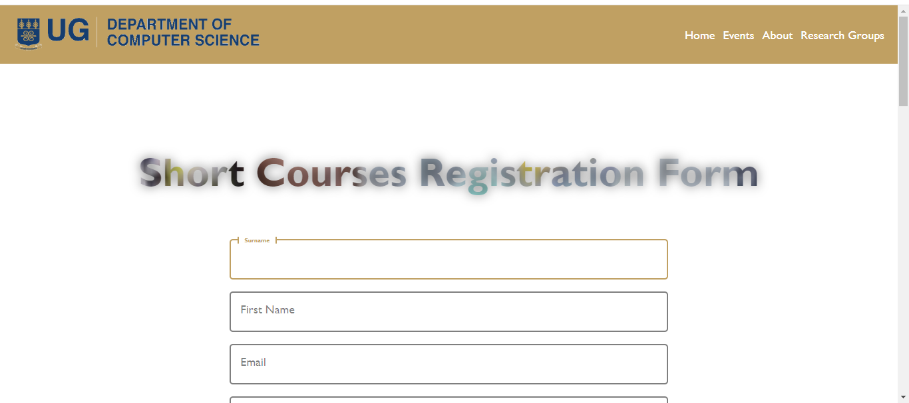
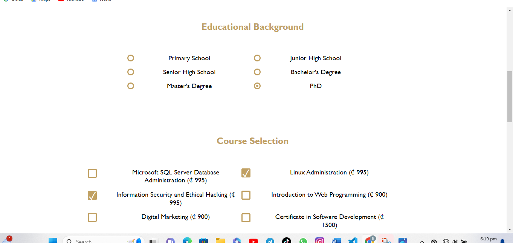


### Students Complaint Form Page

#### Mobile

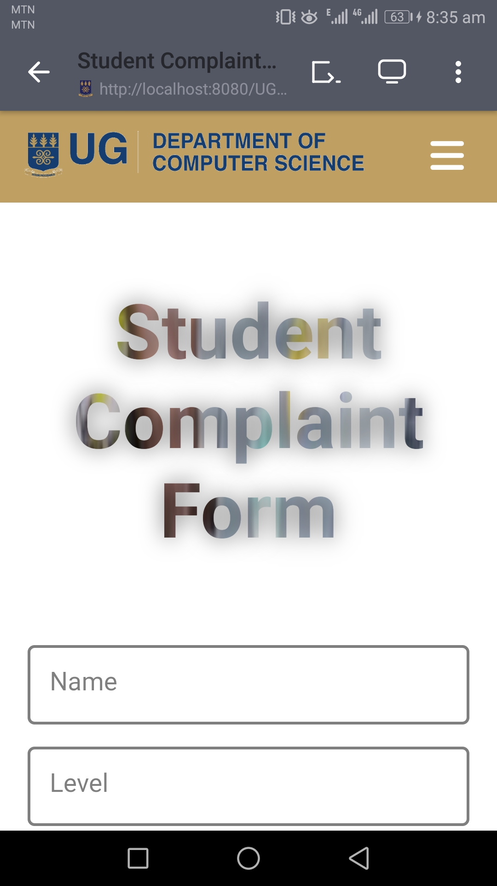

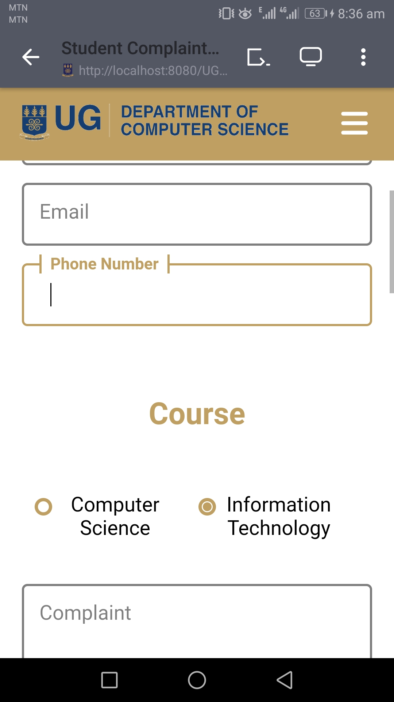
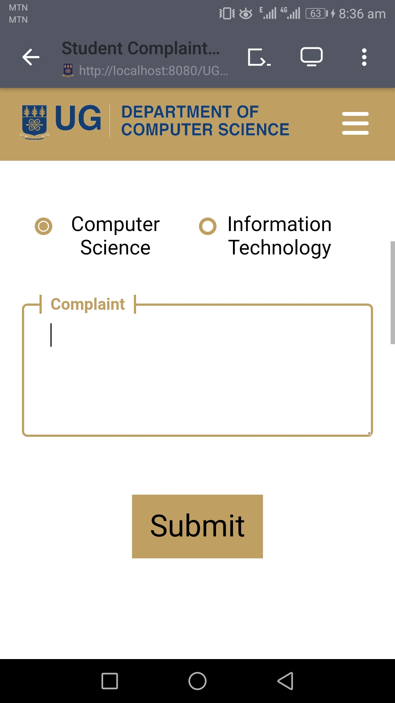


#### Laptop/Desktop 


## Project Insights

Throughout this project, I gained a better understanding in the usage of:
- **Web Development:** Utilizing HTML, CSS, and JavaScript for a responsive and visually appealing interface.
- **Version Control:** Effectively using Git for collaborative development and version management.
- **Documentation:** Writing clear and concise documentation for the project.

### 
